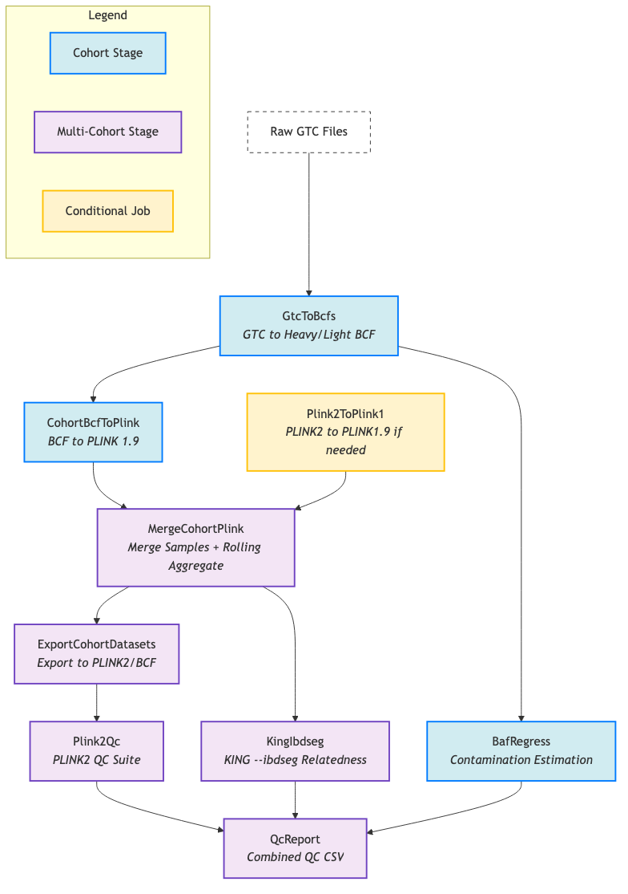

# Population Genomics Genotyping Pipeline

A `cpg-flow` pipeline to process genotyping microarray data, from raw Illumina GTC files to cohort-level PLINK and BCF datasets.

## Project Overview
This pipeline is designed to automate the conversion of dense, single-sample GTC files into analysis-ready, multi-sample datasets. It handles data conversion, quality control, and formatting, producing standard outputs suitable for downstream genetic analysis.

## Pipeline Architecture
The pipeline is composed of several sequential stages, orchestrated by `cpg-flow`. Each stage is responsible for a specific part of the data processing workflow.



### Stages
- **GtcToBcfs**: Converts raw GTC files into two BCF formats: a "Heavy" BCF containing full intensity data and a "Light" BCF containing only genotype calls (GT) and quality scores (GQ).
- **BafRegress**: Estimates sample contamination by analyzing B-Allele Frequencies (BAF) against a population reference. If no reference is provided, it will estimate AF from the cohort.
- **CohortBcfToPlink**: Converts the Light BCF into PLINK 1.9 binary format (`.bed`, `.bim`, `.fam`), preparing it for merging.
- **MergeCohortPlink**: Merges PLINK files from multiple cohorts into a single, unified dataset. This stage also supports a "rolling aggregate" workflow, where new samples can be added to a previously generated aggregate.
- **ExportCohortDatasets**: Converts the merged PLINK 1.9 dataset into PLINK2 (`.pgen`) format for long-term storage and analysis, and `.bcf` format in temporary storage for ancestry analysis.
- **Plink2Qc**: Performs a standard suite of quality control checks on the final PLINK2 dataset, including sample/variant missingness, allele frequency, HWE, heterozygosity, and kinship.

## Prerequisites
Before running the pipeline, ensure you have the following tools installed and configured:
- **`cpg-flow`**: The core workflow management system.
- **`analysis-runner`**: The command-line tool used to launch `cpg-flow` pipelines in the cloud.
- **Docker**: Required for running the local reproduction scripts.

## Configuration
The pipeline is configured using a TOML file (e.g., `config.toml`). A template is provided in `src/popgen_genotyping/config_template.toml`.

### Key Parameters
- `[workflow]`:
    - `dataset`: The analysis dataset for the output.
    - `input_cohorts`: A list of cohort IDs to include in the run.
    - `sequencing_type`: Must be set to `array`.
    - `driver_image`: The Docker image for the main `cpg-flow` driver.
    - `bcftools_image`, `plink_image`: Docker images for the respective tools.
- `[popgen_genotyping.references]`:
    - `fasta_ref_path`: Path to the human genome FASTA reference.
    - `bpm_manifest_path`: Path to the Illumina BPM manifest file.
    - `egt_cluster_path`: Path to the Illumina EGT cluster file.
    - `af_ref_path` (optional): Path to a VCF containing population allele frequencies for `BafRegress`.
- `[popgen_genotyping.rolling_aggregate]`:
    - `previous_analysis_id` (optional): The Metamist analysis ID of a previous `MergeCohortPlink` output to enable rolling aggregate mode.

## Execution
To run the pipeline, use the `analysis-runner` command. You will need to specify the path to your configuration file, the output directory, and the script to execute.

```bash
analysis-runner
    --dataset <your-dataset>
    --output-dir <output-directory>
    --config config.toml
    run_workflow.py
```

## Local Development & Testing
This repository includes scripts for local development and testing.

- **`test/scripts/reproduce_full_pipeline.py`**: A modular script that reproduces the entire pipeline workflow locally using Docker. This is useful for verifying changes and understanding the pipeline's behavior.
- **`test/scripts/reproduce_bafregress_production.py`**: A specialized test for `BafRegress` using a production-sized cohort (94 samples) and internal AF estimation.

To run the local tests, ensure Docker is running and execute the scripts directly. For example:
```bash
python3 test/scripts/reproduce_full_pipeline.py --samples 5 --snps 10000
```
