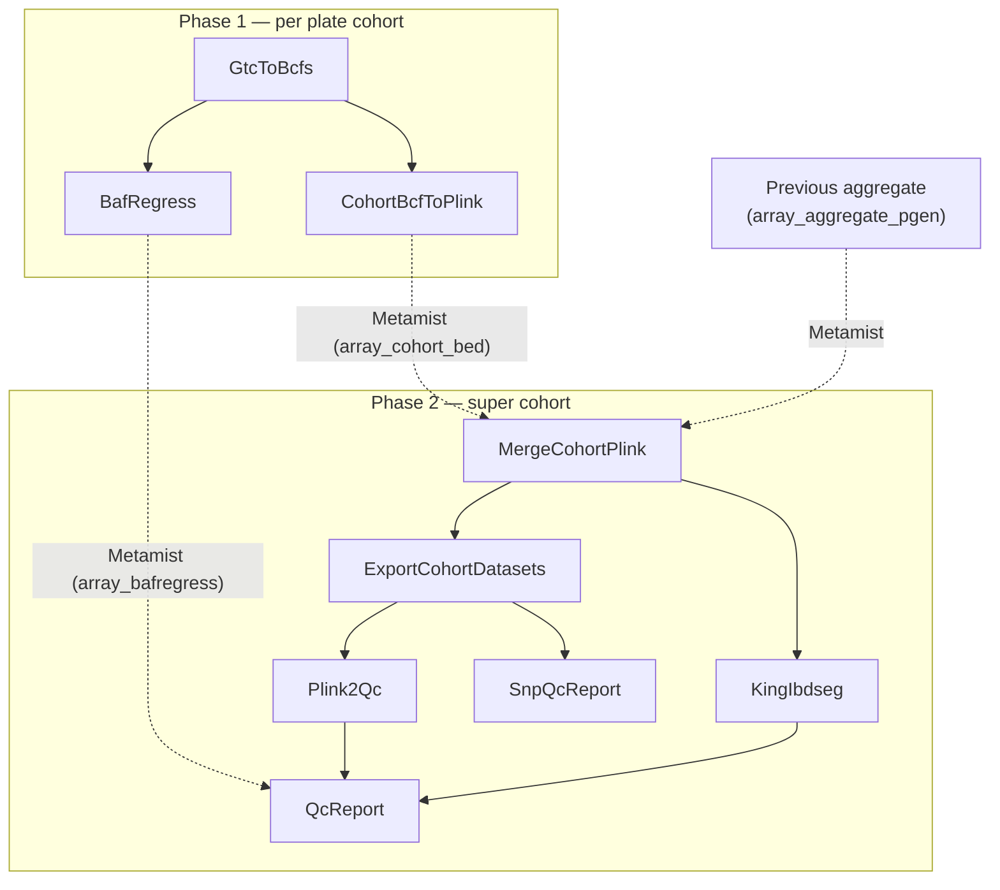

# Population Genomics Genotyping Pipeline

A `cpg-flow` pipeline to process genotyping microarray data, from raw Illumina GTC files to cohort-level PLINK and BCF datasets.

## Project Overview
This pipeline is designed to automate the conversion of dense, single-sample GTC files into analysis-ready, multi-sample datasets. It handles data conversion, quality control, and formatting, producing standard outputs suitable for downstream genetic analysis.

## Pipeline Architecture
The pipeline is composed of several sequential stages, orchestrated by `cpg-flow`. Each stage is responsible for a specific part of the data processing workflow.


```mermaid
flowchart TB
    subgraph phase1 ["Phase 1 — per plate cohort"]
        GtcToBcfs --> BafRegress
        GtcToBcfs --> CohortBcfToPlink
    end
    subgraph phase2 ["Phase 2 — super cohort"]
        MergeCohortPlink --> ExportCohortDatasets
        MergeCohortPlink --> KingIbdseg
        ExportCohortDatasets --> Plink2Qc
        ExportCohortDatasets --> SnpQcReport
        Plink2Qc --> QcReport
        KingIbdseg --> QcReport
    end
    prev["Previous aggregate<br/>(array_aggregate_pgen)"] -. Metamist .-> MergeCohortPlink
    CohortBcfToPlink -. "Metamist (array_cohort_bed)" .-> MergeCohortPlink
    BafRegress -. "Metamist (array_bafregress)" .-> QcReport
```

The dashed edges are not stage dependencies: phase 2 discovers phase-1 outputs (and the
previous aggregate) by querying registered Metamist analyses, which is what lets the two
phases run as separate submissions with the manual super-cohort creation in between.

### Stages
- **GtcToBcfs**: Converts raw GTC files into two BCF formats: a "Heavy" BCF containing full intensity data and a "Light" BCF containing only genotype calls (GT) and quality scores (GQ).
- **BafRegress**: Estimates sample contamination by analyzing B-Allele Frequencies (BAF) against a population reference. If no reference is provided, it will estimate AF from the cohort. Output is written to durable, version-independent storage and registered as an `array_bafregress` Metamist analysis (one per plate cohort).
- **CohortBcfToPlink**: Converts the Light BCF into PLINK 1.9 binary format (`.bed`, `.bim`, `.fam`), preparing it for merging. Output is written to durable, version-independent storage and registered as an `array_cohort_bed` Metamist analysis (one per plate cohort). See [Per-plate outputs are immutable](#per-plate-outputs-are-immutable).
- **SubmitPhase2**: The final phase-1 stage. Creates the super cohort in Metamist (previous aggregate SGs ∪ this run's plate SGs) and submits `second_workflow` against it via analysis-runner. See [Rolling aggregate & two-phase run](#rolling-aggregate--two-phase-run).
- **MergeCohortPlink**: Merges PLINK files from multiple cohorts into a single, unified dataset. This stage also supports a "rolling aggregate" workflow, where new samples are added to a previously generated aggregate. See [Rolling aggregate & two-phase run](#rolling-aggregate--two-phase-run).
- **ExportCohortDatasets**: Converts the merged PLINK 1.9 dataset into PLINK2 (`.pgen`) format for long-term storage and analysis, and `.bcf` format in temporary storage for ancestry analysis.
- **Plink2Qc**: Performs a standard suite of quality control checks on the final PLINK2 dataset, including sample/variant missingness, allele frequency, HWE, heterozygosity, and kinship.
- **KingIbdseg**: Runs KING `--ibdseg --degree 3` against the merged PLINK 1.9 dataset to call pairwise IBD segments. Emits autosomal `.seg` / `.segments.gz` and (when chrX SNPs are present) X-chr companions `X.seg` / `X.segments.gz`, plus the captured KING log. Outputs land in long-term storage and are registered as an `array_relatedness_ibdseg` Metamist analysis; folding the pairwise summary into the QC CSV is tracked as a follow-up.

### Per-plate outputs are immutable
`CohortBcfToPlink` and `BafRegress` write to durable, **version-independent** paths
(`<default_prefix>/<workflow>/<StageName>/<cohort_id>...`, with no `workflow.version`
segment). This decouples a plate's outputs from the pipeline version — a plate is processed
once and reused across runs, and phase 2 no longer has to run at the same `workflow.version`
before `tmp` is garbage-collected to find them.

Because there is no version segment, re-processing a plate **overwrites in place**. cpg-flow
skips a stage whose `expected_outputs` already exist, so the default is reuse (not silent
overwrite); an overwrite only happens if the outputs are deleted and regenerated — which
would change the bytes any prior aggregate was built from. **Treat per-plate outputs as
immutable once an aggregate references them.** To legitimately re-process a plate, prefer a
new cohort rather than overwriting an existing one.

### Rolling aggregate & two-phase run
Aggregate datasets are registered against a **super cohort** (previous aggregate SGs + new
plate SGs) so downstream consumers (e.g. the genomic atlas) can query array data by cohort.
cpg-flow cannot create or validate a cohort mid-run — a cohort must exist before the DAG is
built — so the pipeline runs as two chained analysis-runner runs with separate entry points:

1. **Phase 1 (`first_workflow`)** — run against the **new plate cohorts**
   (`input_cohorts=[new plates]`, `config_phase1.toml`). Produces and registers the per-plate
   `array_cohort_bed` and `array_bafregress` outputs. The final `SubmitPhase2` stage then, in
   a batch job: creates the super cohort (previous aggregate SGs ∪ this run's plate SGs,
   reusing an existing cohort with identical membership rather than duplicating it) and
   submits phase 2 against it. The hand-off works because the cohort is created at batch
   runtime, before the phase-2 driver builds its DAG. The job POSTs to the analysis-runner
   server directly and fails loudly on any HTTP error (the `run_analysis_runner` helper
   swallows them).
2. **Phase 2 (`second_workflow`)** — runs against the **super cohort**
   (`input_cohorts=[super]`, set automatically by `SubmitPhase2`; `config_phase2.toml` for a
   manual run). Rolls the previous aggregate forward and merges only the new plates.

Every stage is a `CohortStage`, so nothing in the stage graph itself separates the phases: a
phase-2 submission would otherwise also run the per-plate stages on the super cohort, and a
phase-1 submission would run the aggregate stages once per plate. The split entry points are
what pin each submission to its phase's stages. Each entry point additionally rejects a
`workflow.only_stages` selection naming stages outside its phase (cpg-flow skips stages by
exact name match, so a typo or other-phase name would be silently skipped), and
`second_workflow` refuses to run against anything other than exactly one cohort (the super
cohort) — a mismatched config fails at submission (in the driver job's log), before any job
is queued.

To accumulate plates across several phase-1 runs before a single aggregation, set
`workflow.last_stages = ['BafRegress', 'CohortBcfToPlink']` on the early runs so only the
final one hands off to phase 2. Phase 2 can also be launched manually against a hand-made
super cohort.

The hand-off is guarded on both sides: cohort creation fails if the created cohort is
missing any requested SG (rather than shipping a quietly smaller cohort), and the
submission record is written *before* the phase-2 submission so a re-run of phase 1 can
never submit phase 2 twice (the job also refuses at runtime if the record already exists).
If the submission itself fails, delete the sentinel TOML at
`<dataset prefix>/popgen_genotyping/SubmitPhase2/<workflow.version>/<multicohort-name>_phase2_submitted.toml`
and re-run phase 1 — the created cohort is found by membership and reused. Keep
`check_expected_outputs = true`: the existing sentinel is what skips the stage on re-run.

The previous aggregate is selected explicitly by **cohort ID** (`previous_aggregate_cohort_id`).
The new plates are **not listed** in phase-2 config — they are **derived**
(`NEW = super − previous aggregate`), and each new SG is resolved to its plate via the registered
`array_cohort_bed` analysis. The resolved plan (the contributing plate cohorts and their new-SG
counts) is printed to the phase-2 driver log: check the plates match what you ran in phase 1.
Use `scripts/list_aggregates.py` to pick the previous aggregate cohort.

**Why derive the new plates instead of reusing the phase-1 plate list?** It might look simpler to
just carry the plate cohorts forward from phase 1, but deriving from the super cohort's membership
keeps that cohort the single source of truth and is robust to things a hand-carried list gets wrong:
- **Withdrawn / inactivated SGs** — an SG dropped since phase 1 is simply absent from the super
  cohort, so it is excluded automatically; a static plate list would silently re-include it.
- **Plates accumulated across several phase-1 runs** — phase 1 can run many times before a single
  phase-2 aggregation; you never have to collate every plate cohort ID from all those runs.
- **Custom / partial selection** — the super cohort can be any hand-picked SG set (a subset of a
  plate, or spanning plates); per-SG resolution handles this, whereas a plate list cannot.
- **No config drift** — the merged output cannot disagree with the cohort it is registered against;
  the post-`--keep` kept-sample-count assert plus the per-SG coverage check catch any plate
  never run through phase 1, failing loudly instead of producing a silently short aggregate.

With the automatic hand-off the plan printout is a post-hoc audit rather than a gate; the hard
guarantee is the merge-time membership assert below, which fails the run outright on any
disagreement.

The final `plink --keep` trims the merged fileset to super-cohort membership (`merged ⊆ super`) and
asserts the kept-sample count equals the super cohort (`super ⊆ merged`) before the aggregate is
registered, so the released dataset cannot silently disagree with the cohort it registers against.

All phase-2 output filenames embed the super-cohort ID (e.g. `<cohort_id>_merged.bed`,
`<cohort_id>.pgen`). Every rolling aggregate gets a new super cohort, so successive
aggregates at the same `workflow.version` land on distinct paths — cpg-flow's skip-if-exists
can therefore never reuse a previous super cohort's merge for a new one. The filenames carry
no datestamp: paths are stable across days, so an interrupted phase 2 can be resumed (or a
single stage re-run with `only_stages`) later without recomputing everything upstream.

## Prerequisites
Before running the pipeline, ensure you have the following tools installed and configured:
- **`cpg-flow`**: The core workflow management system.
- **`analysis-runner`**: The command-line tool used to launch `cpg-flow` pipelines in the cloud.
- **Docker**: Required for running the local reproduction scripts.

## Configuration
The pipeline is configured using a TOML file, one per phase: start from
`src/popgen_genotyping/config_phase1.toml` (per-plate processing) or
`src/popgen_genotyping/config_phase2.toml` (aggregation against the super cohort).

### Key Parameters
- `[workflow]`:
    - `dataset`: The analysis dataset for the output.
    - `input_cohorts`: A list of cohort IDs to include in the run — the new plate cohorts in
      phase 1, exactly the super cohort in phase 2.
    - `only_stages` (optional): A within-phase subset to re-run (e.g. just `QcReport`).
      The entry point pins the phase's stage list; a selection naming stages outside the
      phase is rejected (see
      [Rolling aggregate & two-phase run](#rolling-aggregate--two-phase-run)).
    - `sequencing_type`: Must be set to `array`.
    - `driver_image`: The Docker image for the main `cpg-flow` driver.
    - `bcftools_image`, `plink_image`, `king_image`: Docker images for the respective tools.
- `[popgen_genotyping.references]`:
    - `fasta_ref_path`: Path to the human genome FASTA reference.
    - `bpm_manifest_path`: Path to the Illumina BPM manifest file.
    - `egt_cluster_path`: Path to the Illumina EGT cluster file.
    - `af_ref_path` (optional): Path to a VCF containing population allele frequencies for `BafRegress`.
- `[popgen_genotyping.merge_cohort_plink]`:
    - `previous_aggregate_cohort_id` (required): The Metamist **cohort ID** of a previous aggregate to roll forward, or the literal `'bootstrap'` to declare a from-scratch build. There is no default: a forgotten entry fails the run rather than silently building a new-plates-only aggregate. Used by `SubmitPhase2` (super-cohort membership) and `MergeCohortPlink` (carried aggregate), so the two phases cannot drift. Use `scripts/list_aggregates.py` to list registered aggregate cohorts and pick one. See [Rolling aggregate & two-phase run](#rolling-aggregate--two-phase-run).
- `[popgen_genotyping.submit_phase2]`:
    - `super_cohort_name` (required for phase 1): Name for the super cohort `SubmitPhase2` creates. Must not collide with an existing cohort name; ignored when a cohort with identical membership already exists (it is reused).

## Execution
Launch phase 1 with the `analysis-runner` command against this repo's image (the phase-2 run
is submitted automatically):

From the repo root:

```bash
analysis-runner \
    --skip-repo-checkout \
    --image australia-southeast1-docker.pkg.dev/cpg-common/images/popgen_genotyping:0.1.0-28 \
    --dataset <your-dataset> \
    --access-level full \
    --output-dir <output-directory> \
    --config src/popgen_genotyping/config_phase1.toml \
    --description 'popgen genotyping phase 1' \
    first_workflow
```

The image must match `workflow.driver_image` in the config; nothing validates this, so be
precise about which value governs what: the phase-1 driver runs in the CLI `--image`, while
the `SubmitPhase2` job and the whole of phase 2 use `workflow.driver_image` from the config —
if they drift, the two phases run different code. Pin an exact tag, never `:latest`: phase 2
resolves the image string at its own start, so a floating tag can also run the two phases on
different code. CI builds a new `<VERSION>-<n>` tag on every merge to main; list them with:

```bash
gcloud artifacts docker tags list australia-southeast1-docker.pkg.dev/cpg-common/images/popgen_genotyping
```

To run phase 2 manually against an existing super cohort, swap in `config_phase2.toml` with
`workflow.input_cohorts = [<super cohort ID>]` (and a matching description) and substitute
`second_workflow` above. Note the submission-time checks and the merge-plan printout run on
the **driver job**, after `analysis-runner` has already returned — check the driver batch's
log for the plan (phase 2) or for the ValueError if the config was rejected.

## Local Development & Testing
This repository includes scripts for local development and testing.

- **`test/scripts/reproduce_full_pipeline.py`**: A modular script that reproduces the entire pipeline workflow locally using Docker. This is useful for verifying changes and understanding the pipeline's behavior.
- **`test/scripts/reproduce_bafregress_production.py`**: A specialized test for `BafRegress` using a production-sized cohort (94 samples) and internal AF estimation.

To run the local tests, ensure Docker is running and execute the scripts directly. For example:
```bash
python3 test/scripts/reproduce_full_pipeline.py --samples 5 --snps 10000
```
