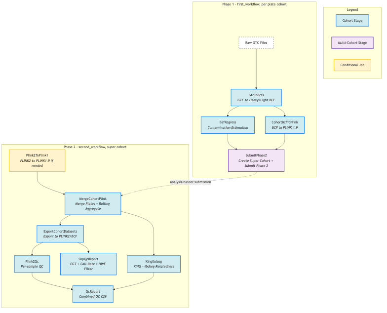

# Population Genomics Genotyping Pipeline

A `cpg-flow` pipeline to process genotyping microarray data, from raw Illumina GTC files to cohort-level PLINK and BCF datasets.

## Project Overview
This pipeline is designed to automate the conversion of dense, single-sample GTC files into analysis-ready, multi-sample datasets. It handles data conversion, quality control, and formatting, producing standard outputs suitable for downstream genetic analysis.

## Pipeline Architecture
The pipeline is composed of several sequential stages, orchestrated by `cpg-flow`. Each stage is responsible for a specific part of the data processing workflow.



### Stages
- **GtcToBcfs**: Converts raw GTC files into two BCF formats: a "Heavy" BCF containing full intensity data and a "Light" BCF containing only genotype calls (GT) and quality scores (GQ).
- **BafRegress**: Estimates sample contamination by analyzing B-Allele Frequencies (BAF) against a population reference. If no reference is provided, it will estimate AF from the cohort.
- **CohortBcfToPlink**: Converts the Light BCF into PLINK 1.9 binary format (`.bed`, `.bim`, `.fam`), preparing it for merging.
- **MergeCohortPlink**: Merges the new plates' PLINK files into a single, unified dataset, optionally folding in a previously generated aggregate ("rolling aggregate"). Runs in phase 2 against the super cohort — see [Two-phase execution](#two-phase-execution-rolling-aggregates).
- **ExportCohortDatasets**: Converts the merged PLINK 1.9 dataset into PLINK2 (`.pgen`) format for long-term storage and analysis, and `.bcf` format in temporary storage for ancestry analysis.
- **Plink2Qc**: Performs a standard suite of quality control checks on the final PLINK2 dataset, including sample/variant missingness, allele frequency, HWE, heterozygosity, and kinship.
- **KingIbdseg**: Runs KING `--ibdseg --degree 3` against the merged PLINK 1.9 dataset to call pairwise IBD segments. Emits autosomal `.seg` / `.segments.gz` and (when chrX SNPs are present) X-chr companions `X.seg` / `X.segments.gz`, plus the captured KING log. Outputs land in long-term storage and are registered as an `array_relatedness_ibdseg` Metamist analysis; folding the pairwise summary into the QC CSV is tracked as a follow-up.

## Prerequisites
Before running the pipeline, ensure you have the following tools installed and configured:
- **`cpg-flow`**: The core workflow management system.
- **`analysis-runner`**: The command-line tool used to launch `cpg-flow` pipelines in the cloud.
- **Docker**: Required for running the local reproduction scripts.

## Configuration
The pipeline is configured using a TOML file (e.g., `config.toml`). A template is provided in `src/popgen_genotyping/config_template.toml`.

### Key Parameters
- `[workflow]`:
    - `dataset`: The analysis dataset for the output.
    - `input_cohorts`: A list of cohort IDs to include in the run.
    - `sequencing_type`: Must be set to `array`.
    - `driver_image`: The Docker image for the main `cpg-flow` driver.
    - `bcftools_image`, `plink_image`, `king_image`: Docker images for the respective tools.
- `[popgen_genotyping.references]`:
    - `fasta_ref_path`: Path to the human genome FASTA reference.
    - `bpm_manifest_path`: Path to the Illumina BPM manifest file.
    - `egt_cluster_path`: Path to the Illumina EGT cluster file.
    - `af_ref_path` (optional): Path to a VCF containing population allele frequencies for `BafRegress`.
- `[popgen_genotyping.merge_cohort_plink]` (phase 2 — see below):
    - `new_cohort_ids`: The new plate cohorts processed in phase 1, whose per-plate PLINK 1.9 outputs the merge stage reconstructs and folds in (also used for the BAFRegress paths in the QC report).
    - `previous_aggregate_analysis_id` (optional): The Metamist analysis ID of the previous `ExportCohortDatasets` aggregate (PLINK2 `.pgen`) to fold in.

## Execution
To run the pipeline, use the `analysis-runner` command. You will need to specify the path to your configuration file, the output directory, and the script to execute.

```bash
analysis-runner
    --dataset <your-dataset>
    --output-dir <output-directory>
    --config config.toml
    run_workflow.py
```

## Two-phase execution (rolling aggregates)

Building a rolling aggregate runs the pipeline in **two separate invocations** with a
**manual super-cohort creation** in between. This is required because `cpg-flow`
validates `input_cohorts` against Metamist at graph-build time, so a cohort cannot be
created mid-run; and because the two phases operate on different cohorts. The aggregate
is registered against the manually-created "super cohort", giving each aggregate a
single cohort that enumerates its full membership.

1. **Create the super cohort (manual, Swagger).** Create a Metamist cohort whose
   membership is the previous aggregate's sequencing groups **plus** the new plates'
   sequencing groups. It can be created any time before phase 2 (all sequencing groups
   already exist in Metamist).
2. **Phase 1 — per-plate processing.** Run with the new plate cohorts as input, stopping
   before the merge:
   - `input_cohorts = ['COH_new_plate_a', 'COH_new_plate_b']`
   - `last_stages = ['BafRegress', 'CohortBcfToPlink']`
3. **Phase 2 — merge onto the super cohort.** Run with the super cohort as input,
   starting at the merge:
   - `input_cohorts = ['COH_super']`
   - `first_stages = ['MergeCohortPlink']`
   - `[popgen_genotyping.merge_cohort_plink] new_cohort_ids = ['COH_new_plate_a', 'COH_new_plate_b']`
     and (if applicable) `previous_aggregate_analysis_id = <prev aggregate analysis id>`

Phase 2 locates the phase-1 per-plate PLINK 1.9 filesets by reconstructing their
deterministic output paths from `new_cohort_ids`, so **both phases must use the same
`workflow.version`**, and phase 2 must run before those tmp outputs are
garbage-collected (it fails loudly if a fileset is missing). Every stage from
`MergeCohortPlink` onward runs as a `CohortStage` against the single super cohort, so
all aggregate/QC analyses register against it.

## Local Development & Testing
This repository includes scripts for local development and testing.

- **`test/scripts/reproduce_full_pipeline.py`**: A modular script that reproduces the entire pipeline workflow locally using Docker. This is useful for verifying changes and understanding the pipeline's behavior.
- **`test/scripts/reproduce_bafregress_production.py`**: A specialized test for `BafRegress` using a production-sized cohort (94 samples) and internal AF estimation.

To run the local tests, ensure Docker is running and execute the scripts directly. For example:
```bash
python3 test/scripts/reproduce_full_pipeline.py --samples 5 --snps 10000
```
